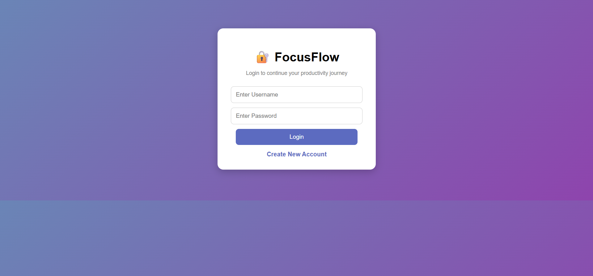
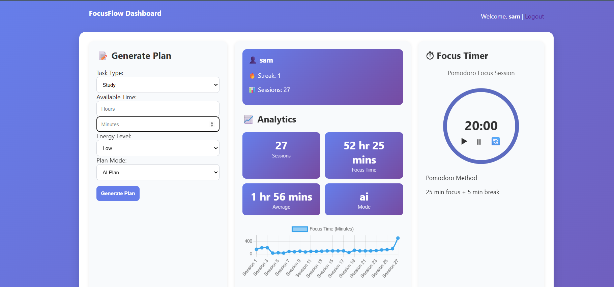
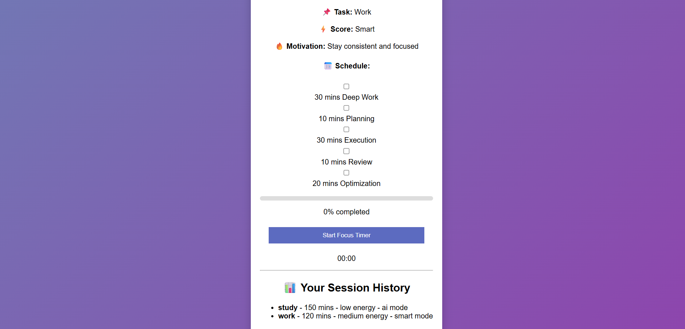

# FocusFlow – AI-Powered Productivity Planner

FocusFlow is a full-stack productivity planning application that generates personalized focus plans based on task type, available time, energy level, and planning mode.

The project was built to explore backend engineering concepts including REST APIs, PostgreSQL integration, JWT authentication, Docker containerization, automated testing, and CI/CD workflows.

---

## Live Demo

https://focusflow-6dz0.onrender.com

---

## Features

### Productivity Planning

* Personalized focus session generation
* Time-based task planning
* Energy-aware recommendations
* Adaptive planning modes

### Backend Engineering

* REST API architecture
* JSON request/response handling
* Input validation and error handling
* Session tracking and analytics

### Security

* JWT authentication
* Protected API routes
* Role-Based Access Control (RBAC)

### Infrastructure

* PostgreSQL database integration
* Environment variable configuration
* Docker containerization
* GitHub Actions CI/CD pipeline

### Quality

* Automated API testing with pytest
* Modular service architecture
* Production-oriented project structure

---

## Screenshots

### Login Page



### Dashboard



### Analytics



---
## Tech Stack

### Backend
- Python
- Flask
- PostgreSQL

### Authentication
- JWT (Flask-JWT-Extended)

### DevOps
- Docker
- Docker Compose
- GitHub Actions

### Testing
- pytest

### Frontend
- HTML
- CSS
- JavaScript

---

## Project Structure

```text
FocusFlow/
├── app.py
├── routes/
├── services/
├── database/
├── templates/
├── static/
├── tests/
├── docs/
├── .github/workflows/
├── Dockerfile
├── docker-compose.yml
└── requirements.txt
```

---

## API Documentation

See:

```text
docs/API.md
```

---

## Installation

### Clone Repository

```bash
git clone https://github.com/Alee-n/FocusFlow.git
cd FocusFlow
```

### Create Virtual Environment

```bash
python -m venv venv
```

### Activate Environment

Windows:

```bash
venv\Scripts\activate
```

Linux/macOS:

```bash
source venv/bin/activate
```

### Install Dependencies

```bash
pip install -r requirements.txt
```

### Configure Environment Variables

Create a `.env` file:

```env
DB_HOST=localhost
DB_NAME=focusflow
DB_USER=postgres
DB_PASSWORD=your_password
DB_PORT=5432

JWT_SECRET_KEY=your_secure_secret
```

### Run Application

```bash
python app.py
```

Application runs on:

```text
http://127.0.0.1:5000
```

---

## Running Tests

```bash
pytest
```

---

## CI/CD

The project uses GitHub Actions to automatically:

* Install dependencies
* Validate application imports
* Run automated checks

on every push to the repository.

---

## Future Improvements

* Real streak tracking based on calendar dates
* Email notifications and reminders
* Team productivity analytics
* Calendar integration
* AI-powered schedule optimization

---

## Author

Lia Aleen Irshad
